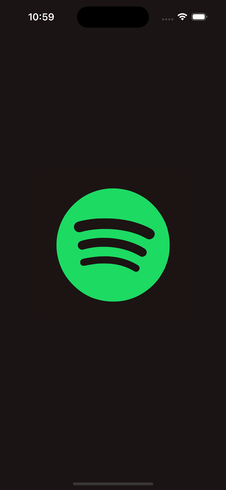

# Swiftify - Spotify Clone

Swiftify is a Swift app clone inspired by Spotify, built using UIKit. It provides a music streaming platform where users can listen to their favorite songs, create playlists, discover new music, and much more. The project utilizes the first-party API from Spotify, and all designs are implemented programmatically.

## Requirements

- iOS 12.0+
- Xcode 11.0+
- Swift 5.0+

## Features To Be

- User Authentication: Allow users to sign up, log in, and log out securely.
- Browse Music: Browse through a vast library of songs, albums, and artists.
- Search Functionality: Search for specific songs, albums, or artists.
- Playlists: Create and manage playlists, add or remove songs.
- Now Playing: Display the currently playing song with controls.
- Discover New Music: Get personalized recommendations based on listening history.
- Audio Streaming: Stream music seamlessly with high-quality audio.
- Offline Playback: Save songs for offline listening.

## Screenshots

## Installation

1. Clone the repository.
2. Open the project in Xcode.
3. Build and run the app on a simulator or a physical device.

## Contributing

Contributions are welcome! Please feel free to fork the repository and submit pull requests.

## License

This project is licensed under the MIT License - see the [LICENSE](LICENSE) file for details.